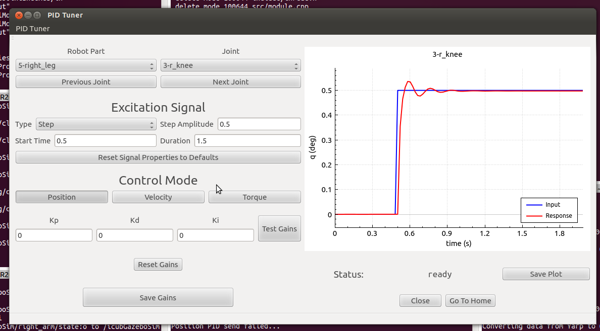

#pidTuner

A graphical tool for tuning the PID control gains for each individual joint of the iCub in position, velocity and torque control.



This tool consists of 2 separate modules, `pidTunerController` and `pidTunerGui`. The controller module talks with the control board devices and manages the control mode states of the robot. Pretty much any control logic is handled in this module. **Launch this module FIRST**.

The GUI module automatically connects to the Control module and allows the user to manually adjust the PID gains, control mode, excitation signal properties, robot part and joint etc. **Launch this module SECOND**. It will wait for the controller ports in any case so if you launch them out of order the universe will not implode.

###Status
Currently the `pidTuner` has only been tested in simulation and some components remain to be implemented/fixed:

- control modes:
    - [x] position
    - [ ] velocity
    - [x] torque

- signal types:
    - [x] step
    - [ ] sign
    - [ ] triangle
    - [ ] square
    - [ ] dirac

As it is tested on more platforms we will list them here but tentatively...

- working on:
    - [x] icubGazeboSim
    - [ ] icubSim
    - [ ] icubParis01
    - [ ] icubParis02

####Note on the simulators
As of now the Pid interfaces with the icub simulators have not been implemented (velocity in gazebo has been I think but it is giving me problems). These may be implemented at least in gazebo to some degree but for now we have to test on the real robot before debugging some of the pid functions.


##Clone and Compile
Navigate to wherever you choose to store this repo and run the following:
```git
git clone https://github.com/rlober/pidTuner.git
```
Now move into the `pidTuner` directory and and compile.

```
cd pidTuner/
mkdir build
cd build
cmake ..
make
```

##Usage
As with all yarp modules there are two ways of going about launching the executables. The hard way and the `yarpmanager` way. Unfortunately the hard way is the one that works right now (a `yarpmanager` app is in the works) but have no fear if you have gotten this far you shouldn't have any problem.

**Terminal 1**
```
yarpserver
```
**Terminal 2**
```
gazebo
```
When Gazebo opens, drop in an `icub_fixed`.


Now in the build directory, `pidTuner/build/`
**Terminal 3**
```
./pidTunerController
```
**Terminal 4**
```
./pidTunerGui
```

Enjoy!


##Updating the GUI
If you decide to make changes to the Qt form `mainwindow.ui` you will have to regenerate its header file. I am not sure why CMake doesn't handle this step

from `pidTuner/build/`...
```
uic ../include/guiModule/mainwindow.ui -o ../include/guiModule/ui_mainwindow.h
```
Now `cmake` and compile...
```
cmake ..
make
```
I am still not sure if the `cmake ..` step is necessary but you can try and let me know.
